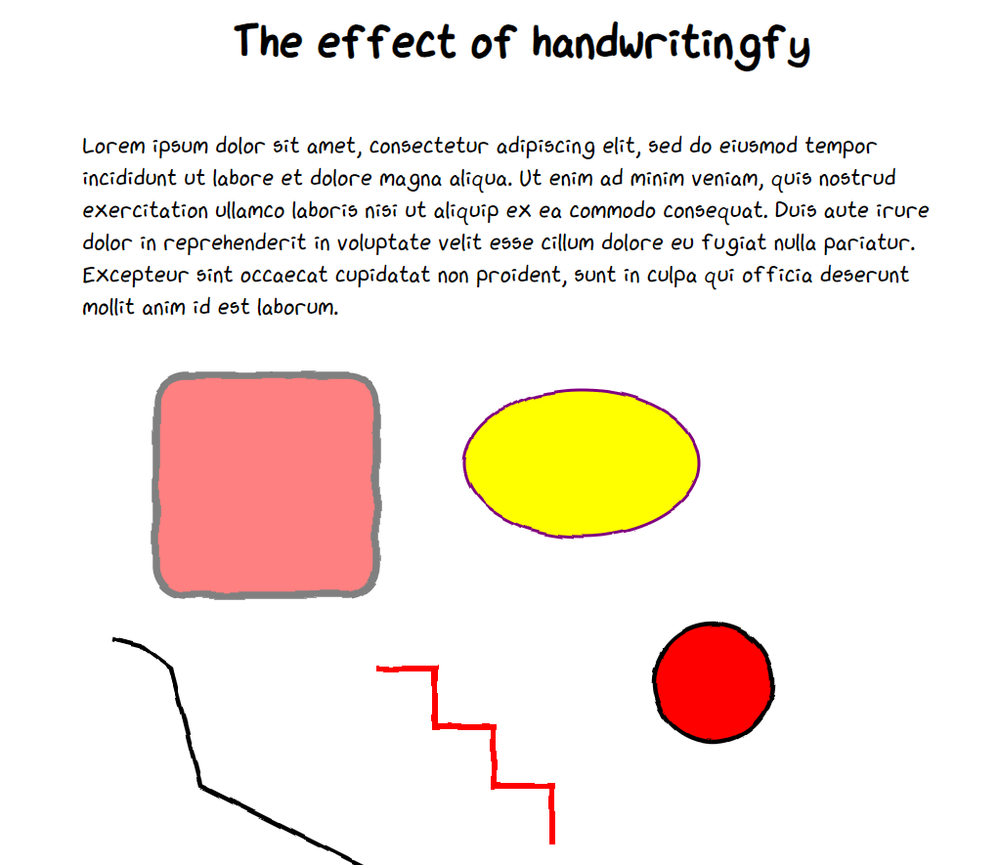
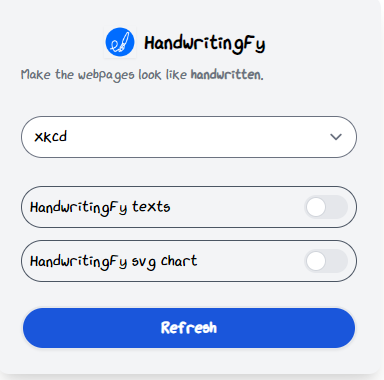

<div align="center">
  <br>
  
</div>

# Overview

Tired of webpages with 'perfect' typography, and pictures with all perfect lines/curves? Want to make them more natural, or sketchy? Give `HandwritingFy` a try by a few clicks.

`HandwritingFy` is a small toy which eanbles to change the style of webpages into handwritten like below screenshot,



<!-- # How

```bash
# install dependencies
yarn install

# dev for the popup of chrome extension
yarn dev

# Build all
yarn build
``` -->

# Production

## chrome extension

Currently this tool has been published as a chrome extension, and you can install it at [chrome web store](https://chrome.google.com/webstore/category/extensions/TODO:....?hl=en-US).

The following screenshot is the extension console (popup), from which you can decide whether handwritingfying text and/or svg of webpages. There have also been around 20 styles available for texts.



You can also check out the demo video:

[](https://www.youtube.com/watch?v=YSWdXLHIoOA)

## Javascript module for developers

If you want to integrate this handwriting style into your own webpage, simply put the following script tag at the end of the `body` tag of your html file. Refer to [example](example/example.html) for details.

```html
<script src="https://cdn.jsdelivr.net/gh/TristanWYL/handwritingfy@1.0.1/dist/handwritingfy.script.iife.min.js"></script>
```

# Acknowledgement

This piece of work is inspred by [this repository](https://github.com/timqian/chart.xkcd). Credits to its author @timqian.

# Other topics

## How to publish a javascaript module

Use [jsdelivr.com](https://www.jsdelivr.com/?docs=gh) and github to host the js module.

1. [Create a github release with a **version number**](https://docs.github.com/en/repositories/releasing-projects-on-github/managing-releases-in-a-repository#creating-a-release),
2. Then the CDNed file could be accessible at https://cdn.jsdelivr.net/gh/TristanWYL/handwritingfy@version_number/dist/handwritingfy.script.iife.min.js.

   **NOTE**: Replace **version number** with the release number.

## How to setup dev environment for Chrome Extension

This is my first time to develop a chrome extension, and it took me a while to setup the dev environment.

**Tech stack:** vitejs

Different from average web applications, a chrome extension can have more than one entry. Take HandwritingFy for example, it has:

- console panel (popup window for users to play around the extension)
- a js script which is executed under the hood of the extension

Extensions could have more entries, such as the option panel etc, but we do not have it here. After you go throough the following details, you will know how to add as many entries as you want.

<!-- ### Dev -->

### Build

As vitejs does not support configs of building htmls and javascript modules in the same config file, we separate the configs into two config files, and apply them with two yarn build commands (`vite build --config vite.config.js`).

#### How to configure build for html

Vitejs recommends to use `rollupOptions` for building html entries,

```js
rollupOptions: {
    input: {
      'index': resolve(__dirname, 'index.html'),
    }
  }
```

The full config file for HandwritingFy could be found at [vite.config.popup.js](vite.config.popup.js)

#### How to configure build for javascript

Vitejs recommends to use [library mode](https://vitejs.dev/guide/build.html#library-mode) for building javascript entries,

```js
lib: {
  /** @desc executable for chrome extension */
  entry: resolve(__dirname, 'src/handwritingfy.chrome.js'),
  name: 'handwritingfy',
  formats: ['iife'],
  fileName: 'handwritingfy.chrome'
}
```

The full config file for HandwritingFy could be found at [vite.config.chrome.js](vite.config.chrome.js)

#### Diable removing the dist

As two builds will output at the same directory `dist/`, we disable vitejs's auto clear of 'dist/' folder by adding an option in the config file,

```js
build: {
  emptyOutDir: false,
}
```

so that two builds can exist at the same folder.

#### Copy

Now we should copy `manifest.json` and related assests like icons and images etc. into 'dist/', so that we can directly zip the dist folder and upload it as an extension package.

Configure a script into `package.json`, so that we can run it with `yarn copy`.

```json
{
  "scripts": {
    "copy": "cp images/logo.png dist/logo.png && cp manifest.json dist/manifest.json"
  }
}
```

#### Wrapping up

Configure a wrapping up script into `package.json`, so that we can do all above work with a simple command `yarn build`,

```json
{
  "scripts": {
    "build": "(rm -R ./dist/* || true) && yarn build-chrome-popup && yarn build-chrome-exec && yarn build-script && yarn copy"
  }
}
```
